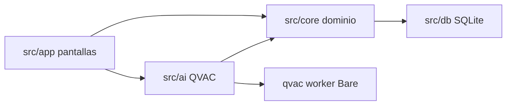
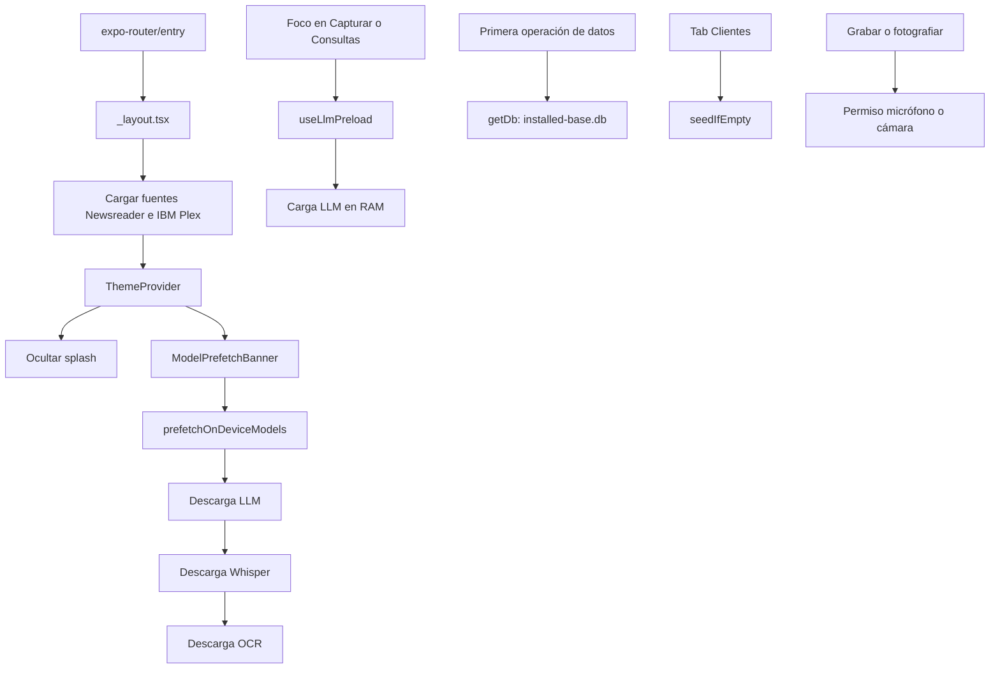
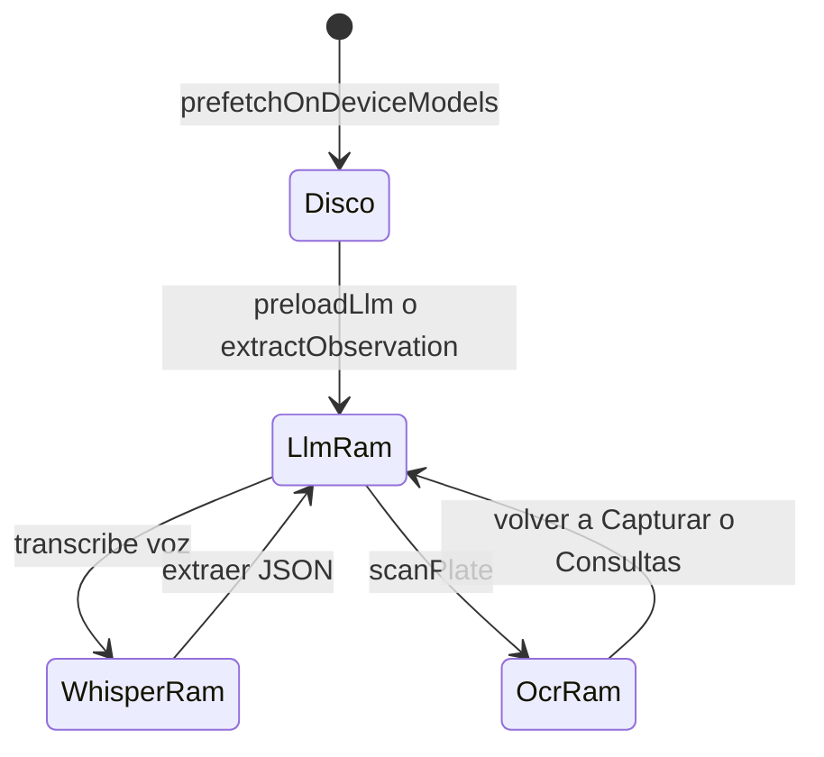
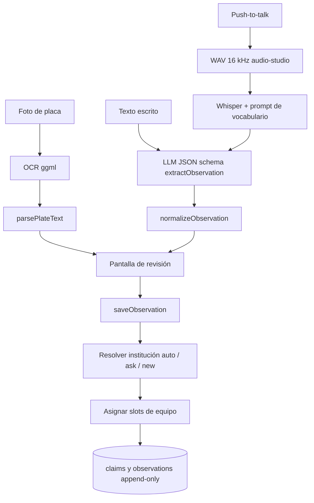
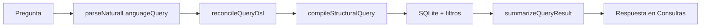
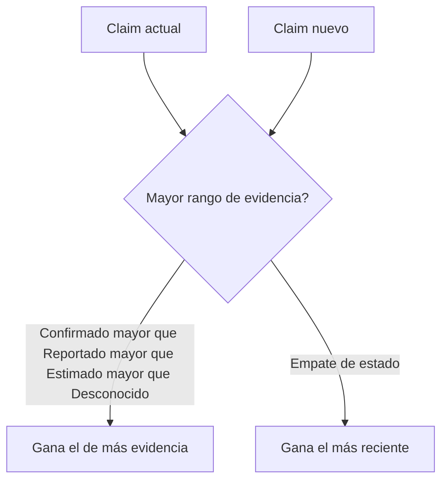
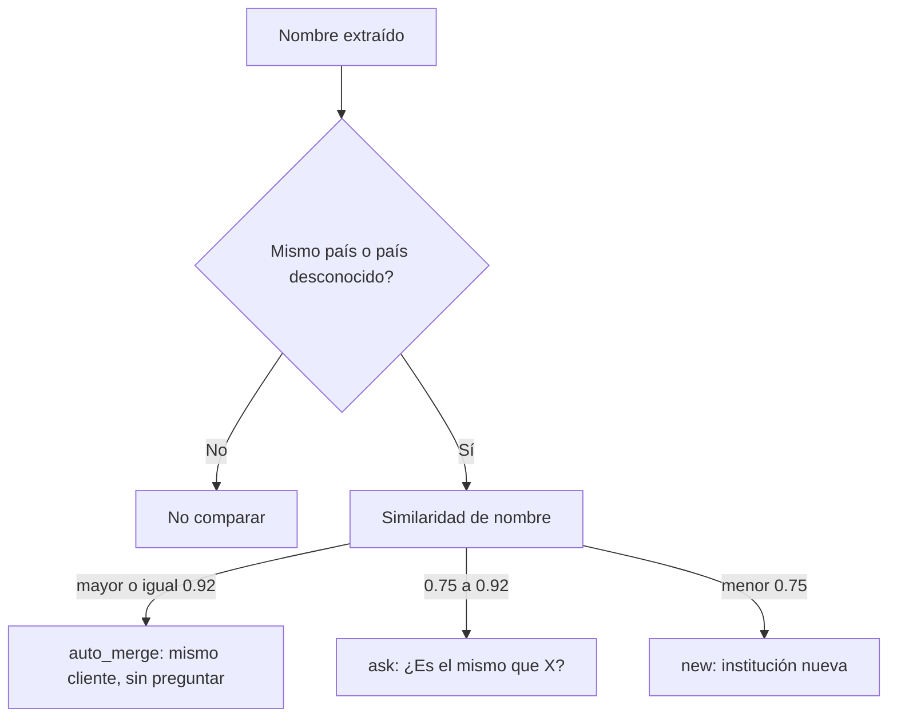
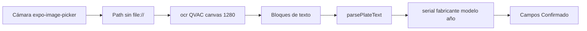

# Q-Pino

App móvil (iOS / Android) para **vigilancia del parque instalado de equipos médicos**. En la visita dictás o escribís una observación, o fotografías la placa del equipo. Q-Pino extrae hospital, modalidad, marca, modelo y antigüedad, evita duplicar clientes y máquinas, y deja consultar el parque en lenguaje natural.

**Toda la inferencia corre en el dispositivo** con [QVAC](https://qvac.tether.io) (`@qvac/sdk`, Tether): extracción, consultas, Whisper y OCR. No hay API de inferencia en la nube. La primera ejecución descarga los pesos al teléfono; después funciona sin red.

El nombre comercial es **Q-Pino**. El repositorio y el slug Expo se llaman `QVAC`.

## Descargar APK (Android)

[**Q-Pino.apk**](https://github.com/Jungus80/Q-Pino/releases/download/v1.0.0/Q-Pino.apk) — release [v1.0.0](https://github.com/Jungus80/Q-Pino/releases/tag/v1.0.0).

En el teléfono se instala como **Q-Pino**. Hace falta permitir instalaciones de fuentes desconocidas. La primera vez necesita internet para bajar los modelos; después funciona sin red. Requiere Android 10+ (`minSdk` 29).

## Video

Demo de Q-Pino: [ver en Google Drive](https://drive.google.com/file/d/1FYTvQBYUPz9Y0vev8d2QuRrKKVpl51aF/view?usp=sharing).

## Equipo de desarrollo

- Ovidio Calderon
- Enrique Fong
- Diego Santimateo
- Jabneel Gonzáles

## Qué hace

| Tab | Ruta | Función |
|-----|------|---------|
| Capturar | `src/app/(tabs)/index.tsx` | Voz, texto o placa → extracción → revisión → guardar |
| Clientes | `src/app/(tabs)/explore.tsx` | Lista de instituciones; seed demo si la base está vacía |
| Dashboard | `src/app/(tabs)/dashboard.tsx` | Métricas agregadas del parque |
| Mapa | `src/app/(tabs)/map.tsx` | Vista LATAM por país |
| Consultas | `src/app/(tabs)/query.tsx` | Preguntas en lenguaje natural sobre el inventario |

Cada dato lleva un nivel de certeza: **Confirmado**, **Reportado**, **Estimado** o **Desconocido**. El detalle está en [Sistema de veracidad](#sistema-de-veracidad).

## Stack

| Capa | Tecnología |
|------|------------|
| App | Expo ~57, React Native 0.86, React 19, TypeScript |
| Routing | `expo-router` (entry: `expo-router/entry`) |
| IA on-device | `@qvac/sdk` ^0.19 — LLM (llama.cpp), Whisper, OCR ggml |
| Worker IA | `react-native-bare-kit` + bundle en `qvac/` |
| Base de datos | `@op-engineering/op-sqlite` (`installed-base.db`, FTS5 + sqliteVec) |
| Audio | `@siteed/audio-studio` (PCM 16 kHz) |
| Cámara | `expo-image-picker` |
| Validación | Zod |
| Tests | Vitest en `src/`; golden sets en `eval/` |

## Arquitectura

La inferencia vive en `src/ai`. El dominio (normalización, resolución de entidades, consultas) vive en `src/core` y se puede testear en Node **sin** QVAC. La persistencia está en `src/db`.

```
src/
├── app/            Pantallas Expo Router
│   ├── _layout.tsx Arranque global (fuentes, splash, prefetch)
│   └── (tabs)/     Capturar, Clientes, Dashboard, Mapa, Consultas
├── ai/             Adaptadores QVAC: ASR, OCR, extracción, consultas, modelManager
├── core/           Dominio puro
│   ├── schema/     Zod + JSON Schema para grammar QVAC
│   ├── normalize/  Geo, catálogo, edad, placa, anclaje de evidencia
│   ├── resolve/    Deduplicación de instituciones y equipos
│   ├── query/      DSL de consultas → SQL
│   └── score/      Confianza y métricas de dashboard
├── db/             SQLite, repos, saveObservation
├── components/     UI
└── hooks/          Prefetch de modelos, preload LLM, nombre del observador
```



## Inicialización

No hay `App.tsx`. El arranque es `expo-router/entry` → [`src/app/_layout.tsx`](src/app/_layout.tsx).



Secuencia:

1. **Fuentes.** Si no cargan, el layout no pinta la UI.
2. **Splash.** `SplashScreen.preventAutoHideAsync()` al inicio; se oculta cuando el tema está listo.
3. **Prefetch de pesos** (disco, no RAM). [`useModelPrefetch`](src/hooks/use-model-prefetch.ts) llama `prefetchOnDeviceModels()` y descarga, en orden: **lenguaje** (LLM), **voz** (Whisper), **placa** (OCR). Hace falta internet solo esta primera vez. El banner muestra progreso y permite reintentar si falla.
4. **Preload del LLM** (RAM). En las tabs Capturar y Consultas, [`useLlmPreload`](src/hooks/use-llm-preload.ts) carga el modelo de lenguaje en segundo plano para que la primera extracción o consulta no espere la carga completa.
5. **SQLite lazy.** El primer `getDb()` abre `installed-base.db` y corre migraciones ([`src/db/client.ts`](src/db/client.ts)). El seed de demo corre al entrar a Clientes si la base está vacía.
6. **Permisos lazy.** Micrófono al grabar; cámara al escanear placa. Están declarados en [`app.json`](app.json).
7. **Nombre del observador.** `useObserverName()` lo pide una vez y lo guarda en `settings`.

### Un solo modelo en RAM

Los teléfonos del perfil objetivo no aguantan LLM + Whisper + OCR a la vez. [`src/ai/modelManager.ts`](src/ai/modelManager.ts) impone **un modelo residente**: `loadExclusive` / `withModel` descarga el anterior antes de cargar el siguiente.



LLM por plataforma:

| Plataforma | Modelo | Backend |
|------------|--------|---------|
| iOS | `QWEN3_5_2B_MULTIMODAL_Q4_K_M` | GPU |
| Android | `QWEN3_5_0_8B_MULTIMODAL_Q4_K_M` | CPU (OpenCL GPU crashéa en este build del SDK) |

Config compartida: `ctx_size: 4096`, `reasoning_budget: 0`.

## Pipelines

### Captura de observación

Voz, texto o placa convergen en el mismo objeto estructurado, se normalizan y se guardan con resolución de entidades.



- **Voz:** [`src/ai/asr.ts`](src/ai/asr.ts) graba con `@siteed/audio-studio` y transcribe con Whisper. El prompt dinámico incluye hospitales y equipos conocidos (`buildWhisperPrompt`).
- **Extracción:** [`src/ai/extract.ts`](src/ai/extract.ts) pide JSON con schema. [`src/core/normalize/pipeline.ts`](src/core/normalize/pipeline.ts) aplica geo, catálogo, edad y un guard contra alucinaciones (`isEvidenceAnchored`).
- **Placa:** [`src/ai/plateOcr.ts`](src/ai/plateOcr.ts) corre OCR Latin (`canvasSize: 1280`). [`src/core/normalize/plate.ts`](src/core/normalize/plate.ts) parsea S/N, REF/MOD y año. En captura parchea el estado en memoria como Confirmado; en detalle de equipo persiste con `saveEquipmentEdit`.
- **Guardado:** [`src/db/saveObservation.ts`](src/db/saveObservation.ts) hace match de institución y equipos y escribe `claims` con evidencia, observador y fecha.

### Consultas en lenguaje natural



El LLM redacta el resumen; `summaryIsGrounded` rechaza texto que no esté anclado a las filas. La interpretación pregunta → DSL se evalúa offline en [`eval/`](eval/README.md).

## Modelos y plugins QVAC

| Uso | Asset SDK | Dónde |
|-----|-----------|-------|
| Extracción y consultas | Qwen multimodal Q4_K_M (2B iOS / 0.8B Android) | `src/ai/extract.ts`, `src/ai/queryParser.ts` |
| Voz → texto | `WHISPER_SMALL_Q8_0` | `src/ai/asr.ts` |
| Placa | `OCR_LATIN` (`MODEL_TYPES.ggmlOcr`) | `src/ai/plateOcr.ts` |

Plugins en [`qvac.config.json`](qvac.config.json):

- `@qvac/sdk/llamacpp-completion/plugin`
- `@qvac/sdk/llamacpp-embedding/plugin`
- `@qvac/sdk/parakeet-transcription/plugin`
- `@qvac/sdk/whispercpp-transcription/plugin`
- `@qvac/sdk/ggml-ocr/plugin`

Los pesos no viven en el repo. QVAC los cachea en el filesystem del dispositivo vía `downloadAsset`. El worker empaquetado está en `qvac/worker.bundle.js`.

## Persistencia

Base: `installed-base.db` (op-sqlite).

Tablas principales: `institutions`, `equipment`, `observations`, `claims`, `settings`. Cada campo escrito genera filas en `claims` (`status`, `evidence`, `observer_id`, `observed_at`).

## Sistema de veracidad

Q-Pino no trata un número extraído como un hecho plano. Cada campo (fabricante, modelo, antigüedad, cantidad) nace con un **estado de evidencia** y se guarda como un `claim`. El historial no se borra: una visita nueva puede ganar o perder frente a la anterior, pero las dos quedan.

### Estados por campo

| Estado | Qué significa | Ejemplo |
|--------|---------------|---------|
| **Confirmado** | Se vio en el equipo (sobre todo la placa / OCR) | Serial o modelo leídos de la etiqueta |
| **Reportado** | Lo dijo alguien en la visita, anclado al texto | «Hay un tomógrafo Siemens del 2018» |
| **Estimado** | Se infiere, no se afirmó con esa precisión | «Más o menos de hace unos años» |
| **Desconocido** | No hay valor usable | El modelo no salió en la nota |

El LLM propone el estado. Después [`normalizeObservation`](src/core/normalize/pipeline.ts) baja a `null` / Desconocido lo que **no está anclado** en el transcript (`isEvidenceAnchored`): si el modelo inventa una marca que no aparece en la nota, no entra.

Una foto de placa parchea fabricante/modelo/año/serial a **Confirmado**. Eso pesa más que un dicho.

### Cómo gana un dato sobre otro

[`chooseBetween`](src/core/truth/consolidate.ts) compara dos claims del mismo campo:



Rango: Confirmado 3 > Reportado 2 > Estimado 1 > Desconocido 0. A igual rango, gana la fecha más nueva. El equipo en pantalla refleja al ganador; los `claims` siguen todos en SQLite.

### Confianza del equipo

[`computeConfidence`](src/core/score/confidence.ts) resume un equipo en un score 0–100 (bandas Alta ≥70 / Media ≥40 / Baja):

- 35% completitud (cuántos campos no son Desconocido)
- 30% fuerza de evidencia (promedio de estados: Confirmado 1, Reportado 0.7, Estimado 0.4)
- 20% frescura (vida media 180 días desde la última verificación)
- 15% confirmaciones independientes

Eso alimenta Dashboard y el detalle de equipo.

### Qué falta, se pregunta

Si un campo sigue Desconocido, [`computeNextQuestion`](src/core/followup/nextQuestion.ts) elige **una** pregunta (sin LLM): primero fabricante, luego antigüedad, modelo, cantidad.

## Duplicidad: hospital y equipo

La veracidad dice qué tan creíble es un campo. La **resolución de entidades** decide si es el mismo hospital o la misma máquina. Un merge silencioso equivocado es peor que un duplicado: por eso, si hay duda, se pregunta.

Antes de comparar nombres, [`stripTrailingPlaceName`](src/core/normalize/geo.ts) saca ciudad/país pegados al nombre («Hospital Andino Sur, Bogotá» → «Hospital Andino Sur») para no mezclar geo con el cliente.

### Institución

[`resolveInstitution`](src/core/resolve/institution.ts) recorre el roster:

1. Si ambos tienen país y **no es el mismo**, no se comparan (un «Hospital Central» en PA no se fusiona con uno en CO).
2. Similaridad fuzzy del nombre (`nameSimilarity`).
3. El mejor candidato cae en una de tres bandas:



Umbrales: `AUTO_MERGE_THRESHOLD = 0.92`, `ASK_THRESHOLD = 0.75`. Se evalúan contra el golden set de [`eval/`](eval/README.md): precisión de auto-merge ≥97%, recall de detección ≥85% (auto-merge + ask cuentan como «lo agarró»).

### Equipo

Dentro del hospital, [`assignToSlot`](src/core/resolve/asset.ts) intenta enganchar la observación a un equipo ya existente.

**Conflicto duro** (`hasHardConflict`) — no se fusionan, aunque el resto se parezca:

- Serial distinto
- Fabricante Reportado+ que no se parece (Jaro-Winkler menor a 0.85)
- `catalogModelId` distinto
- Intervalos de año de instalación que no se solapan, ambos Reportado+

**Score blando** (`matchScore`): un serial **exacto** vale 1 y cierra el match. Si no hay serial, suman modelo/catálogo, fabricante, solape de años y `whichUnit`. Mínimo 0.35. Si los dos mejores candidatos están a menos de 0.15, el resultado es **ambiguous** (preguntar), no un guess.

| Resultado | Qué hace |
|-----------|----------|
| `matched` | Misma máquina: se agrega historial, no se crea otra fila |
| `ambiguous` | Pregunta al usuario |
| `no_match` | Equipo nuevo |

Las cantidades de flota **no se suman**. Dos visitas que dicen «3 resonadores» describen los mismos tres ([`reconcileCount`](src/core/resolve/fleet.ts)). Si discrepan, se marca conflicto y gana el claim con más evidencia.

El serial leído por OCR es la señal más fuerte para no duplicar: misma placa → misma máquina.

## OCR de placa

La placa es la evidencia más fuerte. Corre **on-device** con ggml-ocr (`OCR_LATIN` vía QVAC), no con un LLM mirando la foto.



[`scanPlate`](src/ai/plateOcr.ts):

- Quita el prefijo `file://` (QVAC lee el filesystem, no URIs).
- Carga OCR en exclusivo (`withModel`) y baja el canvas a **1280 px** para que fotos de ~4000 px no revienten la alocación ggml.
- Devuelve líneas crudas más el parse estructurado.

[`parsePlateText`](src/core/normalize/plate.ts) no usa el modelo de lenguaje. Regex + catálogo ficticio:

- **Serial:** etiquetas `S/N`, `SN`, `SIN` (mallectura típica de S/N), `SERIE`. Si el OCR parte `MD2012-` y `00487` en dos bloques, se vuelven a unir.
- **Modelo:** `REF` / `MOD`, o el nombre suelto si matchea el catálogo.
- **Año:** solo junto a `FAB`, `MFG`, `AÑO`, `YEAR`, `FECHA` — un 2018 suelto no se toma (puede ser fragmento de serial).
- **Fabricante:** fuzzy contra [`catalog.json`](src/core/normalize/catalog.json).

Todo lo que sale de la placa se trata como **Confirmado**. En Capturar parchea el estado en memoria antes de guardar; en el detalle del equipo se persiste con `saveEquipmentEdit`.

Se usa desde Capturar ([`src/app/(tabs)/index.tsx`](src/app/(tabs)/index.tsx)) y desde el equipo ([`src/app/equipment/[id].tsx`](src/app/equipment/[id].tsx)).

## Dataset de demostración

No hay un dump clínico real. Lo que usa la app es un **dataset sintético pequeño**, pensado para Clientes, Dashboard y Consultas sin inflar el binario. Se siembra solo si la base está vacía (`seedIfEmpty` en [`src/db/seed.ts`](src/db/seed.ts)).

Los seis clientes viven en [`src/core/demo/seedInstitutions.ts`](src/core/demo/seedInstitutions.ts) (Panamá y Colombia):

| Institución | Ciudad | País | Equipos (resumen) |
|-------------|--------|------|-------------------|
| Hospital DemoCare Pacific | Ciudad de Panamá | PA | MR + US Meridian |
| Clínica Istmo Norte | Colón | PA | CT Solara + US Verdant |
| Hospital Chiriquí Central | David | PA | CT Northfield + XR incompleto |
| Hospital Andino Sur | Bogotá | CO | MR Solara + CT Northfield |
| Clínica Cordillera | Medellín | CO | US Meridian + MG Verdant |
| Centro Médico del Valle | Cali | CO | PET-CT Halcyon + monitoreo Kestrel |

Las observaciones de siembra se marcan como `Dato de siembra (dataset sintético de demostración).` El observador es `seed`. Un equipo queda a propósito incompleto (XR sin marca ni año) para mostrar estados Desconocido.

Referencias pequeñas que acompañan ese seed (no son el parque instalado):

| Archivo | Qué es |
|---------|--------|
| [`src/core/normalize/catalog.json`](src/core/normalize/catalog.json) | Fabricantes y modelos **ficticios** (guardrail del hackathon). Se puede sustituir por un catálogo real sin tocar el resto del código. |
| [`src/core/normalize/gazetteer.json`](src/core/normalize/gazetteer.json) | Gazetteer offline chico (países LATAM + algunas ciudades) para normalizar geo. |
| [`src/core/asr/whisperVocabulary.json`](src/core/asr/whisperVocabulary.json) | Vocabulario ASR Panamá + Colombia. Es independiente del seed de Clientes. |

Los golden sets de [`eval/`](eval/README.md) no se cargan en el teléfono: son casos de prueba (pares de instituciones y preguntas → DSL).

## Cómo correr

Requisitos: Node, Xcode (iOS) o Android SDK (**minSdk 29**).

```bash
npm install
npx expo run:ios
# o
npx expo run:android
```

Scripts:

| Comando | Qué hace |
|---------|----------|
| `npm start` | Metro / Expo |
| `npm run ios` / `npm run android` | Build nativo y run |
| `npm test` | Vitest (dominio en `src/core`) |
| `npm run eval:resolution` | Precisión de deduplicación de instituciones |
| `npm run eval:query` | Pregunta → DSL ([detalle](eval/README.md)) |
| `npm run lint` | ESLint Expo |

La primera ejecución **necesita internet** para bajar modelos. Después la app es offline.

APK listo para instalar: [Q-Pino.apk](https://github.com/Jungus80/Q-Pino/releases/download/v1.0.0/Q-Pino.apk). Para regenerarlo: `cd android && ./gradlew assembleRelease`.

La extracción LLM no se evalúa desde Node: el worker QVAC está atado al runtime Expo. Esa mitad se valida en dispositivo; lo posterior al LLM (normalización, resolución, consultas) sí corre en Vitest y en `eval/`.

## Requisito técnico (art. 10)

| Capacidad | Motor QVAC | Dónde corre |
|-----------|------------|-------------|
| Extraer observación / Consultas | Qwen (llama.cpp) | On-device (GPU iOS / CPU Android) |
| Voz → texto | Whisper | On-device |
| Lectura de placa | OCR ggml | On-device |

La primera vez se **descargan los pesos** al teléfono (no es inferencia remota). Después la app funciona sin red.

## Base preexistente (art. 11)

Producto sustancial construido en la ventana del hackathon. Se reutilizan plantillas y librerías de terceros, declaradas aquí:

| Origen | Uso |
|--------|-----|
| [Expo](https://expo.dev) / `create-expo-app` | Plantilla React Native, routing (`expo-router`), splash, build nativo |
| [@qvac/sdk](https://qvac.tether.io) (Tether) | Inferencia local (LLM, Whisper, OCR) — requisito del evento |
| [BNA UI](https://ui.ahmedbna.com) (componentes copiados al repo) | Kit de UI (botones, cards, toast, etc.) |
| [@siteed/audio-studio](https://github.com/deeeed/expo-audio-stream) | Grabación de voz (no se usa el recorder de Expo Audio) |
| Google Fonts (Newsreader, IBM Plex Sans/Mono) vía `@expo-google-fonts` | Tipografía |
| NativeWind / Tailwind (resto de la plantilla) | Dependencia residual; las pantallas de producto no usan `className` |
| Zod, op-sqlite, lucide-react-native, react-native-reanimated, d3-geo | Utilidades, SQLite, iconos, motion, mapa |

Asistentes de IA de programación: usados durante el desarrollo (art. 11.d).
